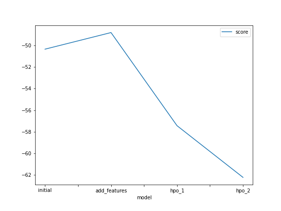
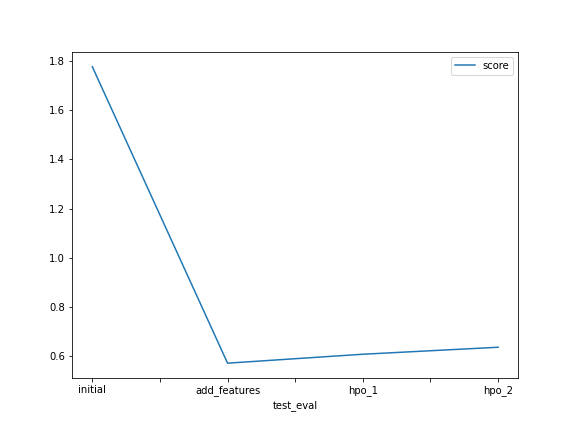

# Report: Predict Bike Sharing Demand with AutoGluon Solution
#### Sudhir Kumar Sah

## Initial Training
### What did you realize when you tried to submit your predictions? What changes were needed to the output of the predictor to submit your results?
I was unable to submit the prediction with the negative values. After I replaced all the negative values with 0, I was able to submit.

### What was the top ranked model that performed?
It was the WeightedEnsemble model that performed the best.

## Exploratory data analysis and feature creation
### What did the exploratory analysis find and how did you add additional features?
I performed the following activities in this regard
- Plotted the histograms for all the numerical columns to understand the data distribution.
- Changed the type of datetime column from object to the datetime64 type.
- I created 3 new columns (month, day and hour) from the datetime column
- I dropped the columns that seemed not so relevant. Dropped columns: datetime, casual and registered.
- Changed the type of columns (season and weather) in both train and test datasets to the category type to assist Autogluon to be able to infer type correctly.

### How much better did your model perform after adding additional features and why do you think that is?
The top ranked model showed nearly 68% of improvement on the test data after introducing additional features. The additional features like day, month and hour are very informative facts towards predicting the demand. 

## Hyper parameter tuning
### How much better did your model perform after trying different hyper parameters?
It didn't perform very well, in fact there was performance degradation of nearly 6% on the test dataset. It occured to me that the default set of hyperparameters are already good enough for many use cases such as establishing the baseline mode. 

### If you were given more time with this dataset, where do you think you would spend more time?
I would use the Autogluon to train several models with its default hyperparameters as they are already good enough. Then, select the three best performed models, use their current scores as the baseline. And then, try to improve over the baseline score by manually tuning the hyper params and with the multiple training runs.    

### Create a table with the models you ran, the hyperparameters modified, and the kaggle score.
|model|num_epochs|time_limit(min)|num_trails|score|
|--|--|--|--|--|
|initial|default|10|default|1.77865|
|add_features|default|10|default|0.56907|
|hpo_1|15|10|default|0.60552|
|hpo_2|10|10|20|0.63405|

### Create a line plot showing the top model score for the three (or more) training runs during the project.

### Create a line plot showing the top kaggle score for the three (or more) prediction submissions during the project.

## Summary

Loaded the training dataset into panda dataframe. Observed the general statistical properties of the training dataset such as count, mean, max and so on using the `pd.describe` method. Then loaded and analyzed the test dataset into panda dataframe and found that two columns ( `casual` and `registered`) were not present, so removed those columns from the training dataset too, also because they are not predictive features.

I then trained the models using autogluon's tabular prediction by setting some of its high level parameters such as time_limit, presets, eval_metrics and so on. Then, reviewed the performance summary of all the models trained. Then, performed the predictions on the test dataset using the top ranked model. Finally submitted the predictions to the Kaggle competition and got back the score. 

Plotted the histogram of the training data (for each of the numerical column) to understand the data distribution. Created new features (month, day and hour) from the `datetime` columns. Changed the type of columns (season and weather) to the `category` type to assist Autogluon to infer the correct type. With the new features, fitted the Autogluon tabular predictor on the training dataset, performed the prediction on the test dataset using the top ranked model, submit the result to the kaggle competition and noted the score received. Made another two training runs by tuning hyper parameters of neural network models type and lightGBM gradient boosted tree type models and noted down the kaggle scores. Finally plotted the model train and test scores.
